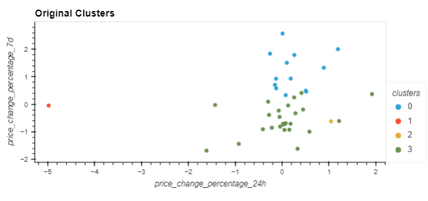
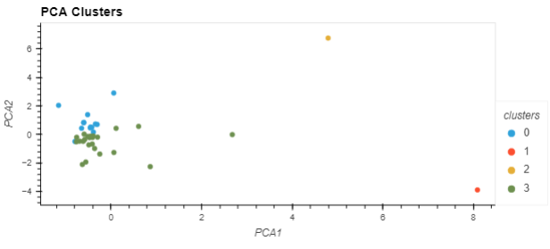

# Crypto_Clustering

For this project I used unsupervised machine learning skills to analyse price change data of cryptocurrencies in different periods using the following steps:

* Import the Data.
* Prepare the Data.
* Find the Best Value for k Using the Original Data.
* Cluster Cryptocurrencies with K-means Using the Original Data.
* Optimize Clusters with Principal Component Analysis.
* Find the Best Value for k Using the PCA Data.
* Cluster the Cryptocurrencies with K-means Using the PCA Data.
* Visualize and Compare the Results.

## Technologies

To run the scripts in this Jupyter notebook file I used the following modules and libraries: pandas, hvplot, pathlib and sklearn.

## Results

I found that when using less features (or columns) with Principal Component Analysis, the clusters can be seen to be more clearly segmented and separated, as shown below:

## Contributors

Owen Harris

